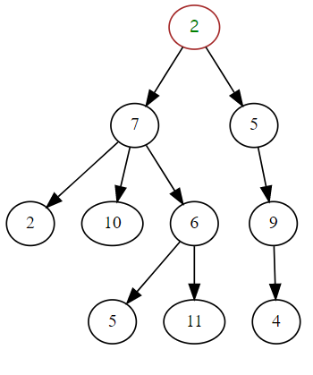
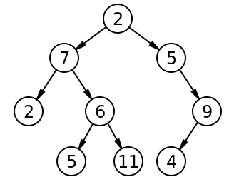
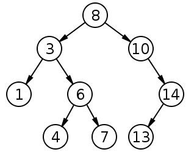
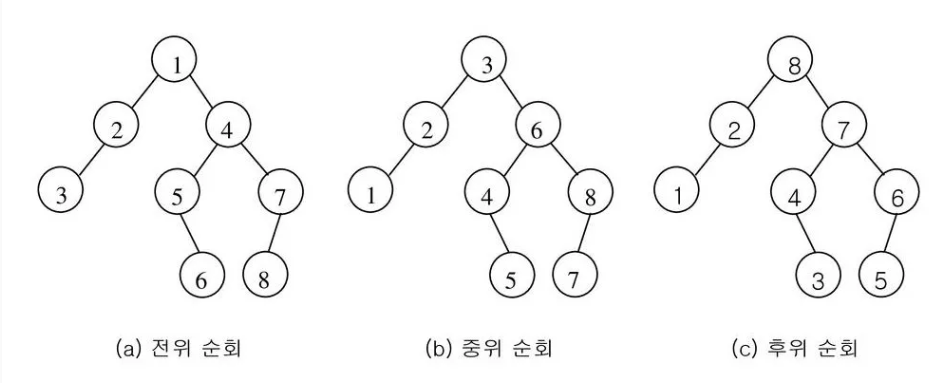
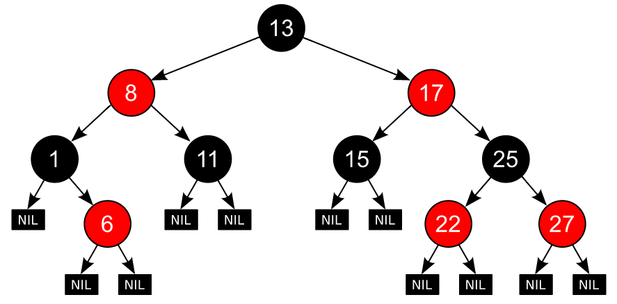

# 자료구조

```
   1. array vector linked list
   2. stack queue
   3. priority queue / deque
   4. hash
   5. heap
   6. graph
   7. tree 이진트리 완전이진트리 이진탐색트리
   8. avl / redblack tree
   9. union-find
```

## 1. Array, Vector, Linked list

✔ Array, Vector: 메모리 공간 기반의 연속 방식

✔ Linked List: 포인터 기반의 연결 방식

### Array(정적 배열)

✔ 정적 배열

✔ 크기를 지정하고 해당 크기만큼의 연속된 메모리 공간을 할당받는 자료형

✔ 한번 생성한 배열의 크기는 고정된다

✔ 조회: O(1) / 탐색: O(N)

✔ 삭제 / 삽입: O(N)
- 기존 원소들을 이동 시켜줘야된다.

```java

int[] numbers = new int[5];

numbers[0] = 10;
numbers[1] = 15;
numbers[2] = 20;
numbers[3] = 30;
numbers[4] = 40;

```


### Vector(동적 배열)

✔ 동적 배열

✔ 전체 크기를 가늠하기 힘든 데이터도 많다! -> 자동으로 크기 조정
- 초기 값을 작게 잡아 배열 생성
- 데이터가 추가 돼서 꽉 채워질 떄마다 늘려준다 (Doubling)
- Python(CPython) 같은 경우 초기에는 2배, 전체적으로는 1.125배
- Java의 ArrayList 같은 경우는 1.5배

✔ 조회: O(1) / 탐색: O(N)

✔ 삭제 / 삽입: O(N)
- 기존 원소들을 이동 시켜줘야된다.

```java
ArrayList<Integer> numbers = new ArrayList<>(Arrays.asList(1, 2, 3, 4, 5));
```

### Linked List (연결 리스트)

✔ 포인터를 활용해 연결 
- 물리 메모리를 연속적으로 사용하지 않아 관리 용이

✔ 동적으로 새로운 노드 삽입/삭제 용이
- 기존 연결을 끊고 포인터만 바꿔주면 된다

✔ 삽입/삭제: O(1) / 조회: O(N)

```java
class Node {
    int value;
    Node next;

    Node(int value, Node next) {
        this.value = value;
        this.next = next;
    }
}

Node head = new Node(1, new Node(2, new Node(3)));
```

## 2. Stack, Queue

### Stack

✔ **LIFO (Last In First Out): 후입 선출**

✔ 재귀, 메모리(스택 영역)에서 사용

```java
import java.util.Stack;

Stack<Integer> stack = new Stack<>();
stack.push(1);
stack.push(2);
stack.push(3);

System.out.println(stack); // Output: [3, 2, 1]

System.out.println(stack.peek()); // Output: 3
System.out.println(stack); // Output: [3, 2, 1]

System.out.println(stack.pop()); // Output: 3
System.out.println(stack); // Output: [2, 1]

```

### Queue

✔ **FIFO (First In First Out): 선입 선출**

✔ BFS, 스케줄링에 사용

```java
import java.util.LinkedList;

LinkedList<Integer> queue = new LinkedList<>();
queue.add(1);
queue.add(2);
queue.add(3);

System.out.println(queue); // Output: [1, 2, 3]

queue.add(4);
System.out.println(queue); // Output: [1, 2, 3, 4]

System.out.println(queue.remove()); // Output: 1
System.out.println(queue); // Output: [2, 3, 4]
```

## 3. Deque

✔ Double Ended Queue

✔ **양쪽 끝에서 원소의 삽입과 삭제가 가능한 자료형 (큐 + 스택)**

```java
import java.util.Deque;
import java.util.ArrayDeque;

Deque<Integer> deque = new ArrayDeque<>();

deque.addFirst(1);
deque.addFirst(2);
deque.addLast(3);
deque.addLast(4);

System.out.println(deque); // Output: [2, 1, 3, 4]

System.out.println(deque.removeFirst()); // Output: 2
System.out.println(deque.removeLast()); // Output: 4
System.out.println(deque); // Output: [1, 3]

System.out.println(deque.peekFirst()); // Output: 1
System.out.println(deque.peekLast()); // Output: 3
```


## 4. Priority Queue, Heap

### Priority Queue(우선순위 큐)

✔ 특정 조건(최소, 최대 등)에 따라 **우선순위가 높은 요소가 추출**되는 자료형

✔ 일반적으로 힙(Heap)을 이용해 구현

✔ 삽입: O(logN)  
✔ 삭제(우선순위): O(logN)  
✔ 조회: O(1)  

```java
import java.util.PriorityQueue;

PriorityQueue<Integer> priorityQueue = new PriorityQueue<>((a, b) -> b - a);
priorityQueue.offer(1);
priorityQueue.offer(2);
priorityQueue.offer(3);

System.out.println(priorityQueue); // Output: [3, 2, 1]

System.out.println(priorityQueue.peek()); // Output: 3

priorityQueue.offer(4);
System.out.println(priorityQueue); // Output: [4, 3, 1, 2]

System.out.println(priorityQueue.poll()); // Output: 4
System.out.println(priorityQueue); // Output: [3, 2, 1]
```

### Heap(힙)

✔ 부모가 항상 자식보다 (작거나/크거나) 같은 힙의 특성을 만족하는 트리 기반의 자료구조

✔ **완전이진트리**

✔ 루트는 항상 최소/최대값

✔ 삽입: O(logN)  
✔ 추출: O(logN) (단순히 루트 노드 추출 자체는 O(1)이나 추출 후 다시 균형을 유지하기에 O(logN))  
 
```java
import java.util.Arrays;

class MaxHeap {
    private int[] heap;
    private int size;

    MaxHeap(int capacity) {
        heap = new int[capacity];
        size = 0;
    }

    int getParentIndex(int i) { return (i - 1) / 2; }

    int getLeftChildIndex(int i) { return 2 * i + 1; }

    int getRightChildIndex(int i) { return 2 * i + 2; }

    boolean hasParent(int i) { return getParentIndex(i) >= 0; }

    boolean hasLeftChild(int i) { return getLeftChildIndex(i) < size; }

    boolean hasRightChild(int i) { return getRightChildIndex(i) < size; }

    int parent(int i) { return heap[getParentIndex(i)]; }

    int leftChild(int i) { return heap[getLeftChildIndex(i)]; }

    int rightChild(int i) { return heap[getRightChildIndex(i)]; }

    void swap(int i, int j) {
        int temp = heap[i];
        heap[i] = heap[j];
        heap[j] = temp;
    }

    void ensureCapacity() {
        if (size == heap.length) {
            heap = Arrays.copyOf(heap, 2 * heap.length);
        }
    }

    void insert(int item) {
        ensureCapacity();
        heap[size] = item;
        size++;
        siftUp(size - 1);
    }

    void siftUp(int i) {
        while (hasParent(i) && parent(i) < heap[i]) {
            int parentIndex = getParentIndex(i);
            swap(parentIndex, i);
            i = parentIndex;
        }
    }

    int extractMax() {
        int max = heap[0];
        heap[0] = heap[size - 1];
        size--;
        siftDown(0);
        return max;
    }

    void siftDown(int i) {
        while (hasLeftChild(i)) {
            int largerChildIndex = getLeftChildIndex(i);
            if (hasRightChild(i) && rightChild(i) > leftChild(i)) {
                largerChildIndex = getRightChildIndex(i);
            }
            if (heap[i] >= heap[largerChildIndex]) {
                break;
            }
            swap(i, largerChildIndex);
            i = largerChildIndex;
        }
    }

    public static void main(String[] args) {
        MaxHeap heap = new MaxHeap(10);
        heap.insert(10);
        heap.insert(5);
        heap.insert(15);
        heap.insert(30);
        heap.insert(20);

        System.out.println(heap.extractMax()); // 30
        System.out.println(heap.extractMax()); // 20
        System.out.println(heap.extractMax()); // 15
        System.out.println(heap.extractMax()); // 10
        System.out.println(heap.extractMax()); // 5
}
}
```

## 5. Hash

### Hash (Function)

✔ **임의의 길이를 갖는 임의의 데이터를 고정된 길이의 데이터로 매핑하는 단방향 함수**

### Hash Collision

✔ **두 개 이상의 키(해시 함수의 입력값)가 해시 테이블의 동일한 인덱스(해시 함수의 출력값)에 매핑되는 현상**

✔ 원인

- **비둘기집 원리**: n+1개의 물건을 n개의 상자에 넣을 때 적어도 어느 한 상자에는 두 개 이상의 물건이 들어 있다는 원리

- **생일 문제**: 여러 사람이 모였을 때 생일이 같은 2명이 존재할 확률은? (23명 -> 50%, 57명 -> 99%)
  - **충돌은 생각보다 쉽게 일어난다**!

✔ 해결
- Chaining: 해시 테이블의 인덱스가 해당 인덱스에 연결된 항목들을 담은 연결리스트를 가리킨다 (java)
- Open Addressing: 충돌 발생 시 탐사를 통해 다음 빈공간을 찾는다 (Python)

### HashMap / HashTable

✔ HashMap / HashTable: **Key(키) - Value(값) 매핑**이 가능한 자료구조

✔ 조회: 평균 O(1) / 최악 O(N)

```java
import java.util.HashMap;

public class Example {
    public static void main(String[] args) {
        // Creating a HashMap
        HashMap<String, Integer> map = new HashMap<>();
        
        // Adding key-value pairs to the map
        map.put("John", 25);
        map.put("Jane", 30);
        map.put("Jim", 35);
        
        // Retrieving values from the map
        System.out.println("Age of John: " + map.get("John"));
        System.out.println("Age of Jane: " + map.get("Jane"));
        System.out.println("Age of Jim: " + map.get("Jim"));
    }
}

// Age of John: 25
// Age of Jane: 30
// Age of Jim: 35
```

## 6. Graph

✔ 노드(node/vertex)와 간선(edge)으로 구성된 자료의 집합 

✔ 노드(Node): 정보의 단위, 간선(Edge): 노드 간의 관계 

✔ 인접리스트 / 인접행렬로 구현

```java
// 인접행렬

N = Integer.parseInt(br.readLine()); // 노드
M = Integer.parseInt(br.readLine()); // 간선 

arr	= new int[N+1][N+1]

for(int i = 0; i < M; i++) {
	st = new StringTokenizer(br.readLine());
	int node1 = Integer.parseInt(st.nextToken());
	int node2 = Integer.parseInt(st.nextToken());
	arr[node1][node2] = 1;
	arr[node2][node1] = 1;
}
```

```java
// 인접리스트

N = Integer.parseInt(br.readLine()); // 노드
M = Integer.parseInt(br.readLine()); // 간선 

LinkedList<Integer>[] adjList = new LinkedList[N + 1];

for (int i = 0; i <= N; i++) {
	adjList[i] = new LinkedList<Integer>();
}

for (int i = 0; i < M; i++) {
	int node1 = Integer.parseInt(st.nextToken());
	int node2 = Integer.parseInt(st.nextToken());
	adjList[node1].add(node2);
	adjList[node2].add(node1);
}
```

## 7. Tree

### Tree



✔ Tree: 무방향이면서 사이클이 없는 연결 그래프

✔ 용어
- 노드(node): 트리를 구성하는 기본 원소
    - 루트 노드(root node/root): 트리에서 부모가 없는 최상위 노드, 트리의 시작점
    - 부모 노드(parent node): 루트 노드 방향으로 직접 연결된 노드
    - 자식 노드(child node): 루트 노드 반대방향으로 직접 연결된 노드
    - 형제 노드(siblings node): 같은 부모 노드를 갖는 노드들
    - 리프 노드(leaf node/leaf): 루트 노드를 제외한 차수가 1인 정점 (자식이 없는 노드)
  
- 경로(path): 한 노드에서 다른 한 노드에 이르는 길 사이에 있는 노드들의 순서
- 길이(length): 출발 노드에서 도착 노드까지 거치는 간선의 개수
- 깊이(depth): 루트 경로의 길이
- 레벨(level): 루트 노드(level=0)부터 노드까지 연결된 간선 수의 합
- 높이(height): 가장 긴 루트 경로의 길이
- 차수(degree): 각 노드의 자식의 개수
- 트리의 차수(degree of tree): 트리의 최대 차수
- 크기(size): 노드의 개수

### Tree vs Graph

✔ 트리는 순환구조를 갖지 않는다!

### 이진트리 (Binary Tree)



✔ 모든 노드의 차수가 2 이하인 트리

✔ 다진 트리에 비해 훨씬 간결하고 알고리즘을 구현하기 쉬워서 많이 쓴다!

✔ 이진트리의 종류

### 이진 탐색 트리 (Binary Search Tree)



✔ 노드의 왼쪽 가지에는 노드의 값보다 작은 값들만 있고, 오른쪽 가지에는 큰 값들만 있도록 구성된 이진트리

✔ (이상적인 상황에서) 탐색/삽입/삭제: O(logN)
- 최악의 경우(편향): O(N) (ex: 1~100)

### 트리의 순회



✔ 중위 순회(in-order traversal): 왼쪽 자손, 자신, 오른쪽 자손 순서로 방문하는 순회 방법
  - 이진 탐색 트리 중위 순회 시 정렬된 결과 반환
  
✔ 전위 순회(pre-order traversal): 자신, 왼쪽 자손, 오른쪽 자손 순서로 방문하는 순회 방법

✔ 후위 순회(post-order traversal): 왼쪽 자손, 오른쪽 자손, 자신 순서로 방문하는 순회 방법

✔ 레벨 순서 순회(level-order traversal): 레벨 순서로 순회(BFS)

## 8. Advanced Tree

### AVL Tree


✔ **자가 균형 이진 탐색 트리**

✔ 일반적인 이진 탐색 트리의 편향성을 보완하기 위해 삽입/삭제 시마다 균형을 맞춰준다 (트리 회전)

✔ 오른쪽 트리와 왼쪽 트리의 높이 차가 1 이하

✔ 모든 상황에서 탐색/삽입/삭제: O(logN)

### Red-Black Tree



✔ **자가 균형 이진 탐색 트리**

✔ 모든 노드는 red or black

✔ 루트 노드는 black

✔ 자식이 없는 노드는 Null Leaf Node (NIL)라고 한다

✔ 모든 NIL은 black

✔ red의 자식은 언제나 black -> red는 연속으로 나올 수 없다! (black은 가능)

✔ 임의의 한 노드에서 null leaf node까지 도달하는 모든 경로에는 null leaf node를 제외하고 항상 같은 수의 블랙 노드 존재

✔ 모든 상황에서 탐색/삽입/삭제: O(logN)

✔ 이진탐색트리 중에 가장 성능이 좋아 일반적으로 많이 사용!

## 9. union-find

✔ 서로소 집합(Disjoint Set)

✔ 여러 개의 노드가 존재할 때, 임의의 두 노드가 같은 그래프에 속해있는지 판별

### Union & Find

✔ **Find**  
    노드 x가 포함된 집합을 찾는 연산

```python
def  find_parent(parent, current):
     if  parent[current] != current:
         return  find_parent(parent, parent[current])
     return  current
```

✔ **Union**  
    노드 x가 포함된 집합과 노드 y가 포함된 두 집합을 통합하는 연산

```python
def  union_parent(parent, x, y):
     x = find_parent(parent, x)
     y = find_parent(parent, y)
     # 단순한 형태에서는 작은 쪽으로 합친다.
     if  x < y:
         parent[y] = x
     else:
         parent[x] = y
```

✔ 코드 예시

```python
# 노드와 간선(union 연산) 개수
node, edge = map(int, input().split())

# 0으로 부모 배열 초기화
parent = [0  for  _  in  range(node + 1)]

# 부모를 자기 자신으로 초기화
for  i  in  range(1, node + 1):
parent[i] = i


# union 연산
for  i  in  range(edge):
a, b = map(int, input().split())
union_parent(parent, a, b)


# 각 원소가 속해있는 집합 출력
for  i  in  range(1, node + 1):
print(find_parent(parent, i), end=' ')
print()


# 부모 테이블 출력
for  i  in  range(1, node + 1):
print(parent[i], end=' ')
```

### 최적화

✔ 경로 압축 (Path compression)

```python
# 경로 압축 -> 부모값 재귀적으로 갱신
def  find_parent_compression(parent, node):
    if  parent[node] != node:
        parent[node] = find_parent_compression(parent, parent[node])
    return  parent[node]
```

✔ Rank 이용 (Union by Rank)

```python
# rank: 각 노드의 rank를 저장할 리스트
rank = [0 for _ in range(N + 1)]

# def union_parent_rank(x, y):
    x = find_parent(x)
    y = find_parent(y)
    if x == y:
        return
    # 랭크가 낮은 집합을 높은 집합으로 병합해준다
    if rank[x] > rank[y]:
        parent[y] = x
    else:
        parent[x] = y
        # 랭크가 동일할 경우
        if rank[x] == rank[y]:
            rank[y] += 1
```

✔ 코드 예시

```python
def find_parent(x):
    if parent[x] != x:
        parent[x] = find_parent(parent[x])
    return parent[x]


def union_parent(x, y):
    x = find_parent(x)
    y = find_parent(y)
    if x == y:
        return
    if rank[x] > rank[y]:
        parent[y] = x
    else:
        parent[x] = y
        if rank[x] == rank[y]:
            rank[y] += 1


# 노드와 간선(union 연산) 개수 
node, edge =  map(int,  input().split())  
# 0으로 부모 배열 초기화 
parent =  [0  for _ in  range(node +  1)]
# 1로 랭크 초기화
rank = [1 for _ in range(node + 1)]

# 부모를 자기 자신으로 초기화
for  i  in  range(1, node + 1):
    parent[i] = i

# union 연산
for  i  in  range(edge):
    a, b = map(int, input().split())
    union_parent(a, b)

# 각 원소가 속해있는 집합 출력
for  i  in  range(1, node + 1):
    print(find_parent(i), end=' ')
print()

# 부모 테이블 출력
for  i  in  range(1, node + 1):
    print(parent[i], end=' ')
```

### Weighted Union Find

✔ parent 배열이 음수일 경우 부모노드로서 음수의 절댓값이 size(rank)가 되고, 양수일 경우 부모노드를 가리킨다

```python
parent = [-1 for _ in range(N + 1)]

def find_parent(x):
    if parent[x] < 0:
        return x
    p = find(parent[x])
    parent[x] = p
    return p

def union_parent(x, y):
    x = find_parent(x)
    y = find_parent(y)

    if x == y:
        return

    if parent[x] < parent[y]:
        parent[x] += parent[y]
        parent[y] = x
    else:
        parent[y] += parent[x]
        parent[x] = y
```