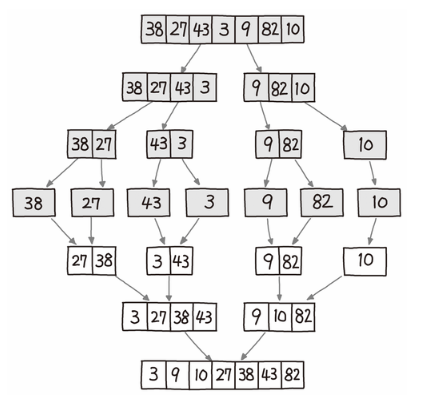
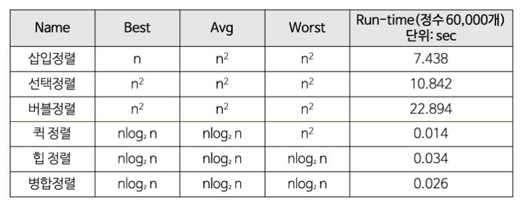

    1. 시간복잡도
    2. 정렬(버블/선택/퀵/병합/삽입)
    3. 재귀
    4. dp
    5. 그래프 기초(dfs bfs) + 백트래킹 
    6. 그래프 심화(벨만포드 / 다익스트라 / 플로이드와샬) 
    7. mst
    8. 분할정복 / 이분탐색 
    9. 그리디

# 알고리즘

## 1. 시간 복잡도

### 시간 복잡도(Time Compexity)

- 컴퓨터 프로그램의 **입력값과 연산 수행 시간의 상관관계**
- 효율적 알고리즘이란?
    - 입력값이 커짐에 따라 증가하는 시간의 비율을 최소화한 알고리즘

### 시간 복잡도의 종류


#### O(1): 상수 시간 복잡도

✔ ex: 인덱스를 통한 접근

<details>

<summary> 예시 코드 </summary>

```java
int[] arr = {1, 2, 3, 4, 5};
int x = arr[2]; // retrieves the element at index 2
```
</details>

#### O(N): 선형 시간 복잡도

✔ ex: 일반적인 순회 및 탐색

<details>

<summary> 예시 코드 </summary>

```java
int[] arr = {5, 3, 8, 1, 7, 2};

int max = Integer.MIN_VALUE;

for (int i = 0; i < arr.length; i++) {
    if (arr[i] > max) {
        max = arr[i];
    }
}

System.out.println("Maximum value: " + max);

```
</details>

#### O(logN): 로그 시간 복잡도

✔ ex: 이분탐색

<details>

<summary> 예시 코드 </summary>


```java
int[] arr = {1, 2, 3, 4, 5, 6, 7, 8, 9};
int target = 5;

int left = 0;
int right = arr.length - 1;

while (left <= right) {
    int mid = (left + right) / 2;
    if (arr[mid] == target) {
        System.out.println("Found at index " + mid);
        break;
    } else if (arr[mid] < target) {
        left = mid + 1;
    } else {
        right = mid - 1;
    }
}
```
</details>

#### O(NlogN): 선형 로그 시간 복잡도

✔ ex: 정렬 (퀵 소트, 머지 소트 등)

<details>

<summary> 예시 코드 </summary>


```java
void quicksort(int[] arr, int left, int right) {
    if (left < right) {
        int pivotIndex = partition(arr, left, right);
        quicksort(arr, left, pivotIndex - 1);
        quicksort(arr, pivotIndex + 1, right);
    }
}

int partition(int[] arr, int left, int right) {
    int pivotValue = arr[right];
    int i = left - 1;

    for (int j = left; j < right; j++) {
        if (arr[j] < pivotValue) {
            i++;
            swap(arr, i, j);
        }
    }

    swap(arr, i + 1, right);

    return i + 1;
}

void swap(int[] arr, int i, int j) {
    int temp = arr[i];
    arr[i] = arr[j];
    arr[j] = temp;
}

int[] arr = {5, 3, 8, 1, 7, 2};
quicksort(arr, 0, arr.length - 1);
System.out.println(Arrays.toString(arr));
```
</details>

#### O(N^2)

✔ ex: 버블 소트, 이차원 배열 탐색 등등

<details>

<summary> 예시 코드 </summary>


```java
public static void bubbleSort(int[] arr) {
    int n = arr.length;
    for (int i = 0; i < n - 1; i++) {
        boolean swapped = false;
        for (int j = 0; j < n - i - 1; j++) {
            if (arr[j] > arr[j + 1]) {
                int temp = arr[j];
                arr[j] = arr[j + 1];
                arr[j + 1] = temp;
                swapped = true;
            }
        }
        if (!swapped) {
            break;
        }
    }
}
```
</details>

#### O(2^N): 지수 시간 복잡도

✔ ex: 부분집합 구하기

<details>

<summary> 예시 코드 </summary>


```java
void generateSubsets(int[] arr) {
    int n = arr.length;
    int totalSubsets = (int) Math.pow(2, n);
    for (int i = 0; i < totalSubsets; i++) {
        for (int j = 0; j < n; j++) {
            if ((i & (1 << j)) != 0) {
                System.out.print(arr[j] + " ");
            }
        }
        System.out.println();
    }
}

int[] arr = {1, 2, 3};
generateSubsets(arr);
```
</details>

## 2. 정렬

✔ 실제 cs 질문에는 각 정렬 방식의 개념에 대한 비교와 수도 코드 작성이 나올 수 있으니 잘 알아두자!

### 버블 정렬 (Bubble Sort)

✔ 인접한 두 원소를 비교하여 정렬하는 알고리즘

✔ 가장 단순하고 직관적이지만 시간 복잡도가 O(N^2)

<details>

<summary> 예시 코드 </summary>

```java
public static void bubbleSort(int[] arr) {
    int n = arr.length;
    for (int i = 0; i < n - 1; i++) {
        for (int j = 0; j < n - i - 1; j++) {
            if (arr[j] > arr[j + 1]) {
                int temp = arr[j];
                arr[j] = arr[j + 1];
                arr[j + 1] = temp;
            }
        }
    }
}

```
</details>


### 선택 정렬 (Selection Sort)

✔ 주어진 배열에서 가장 작은 값을 찾아서 앞으로 가지고 오는 것을 반복하여 정렬하는 알고리즘

✔ 시간 복잡도: O(N^2)

<details>

<summary> 예시 코드 </summary>

```java
public static void selectionSort(int[] arr) {
    int n = arr.length;

    for (int i = 0; i < n - 1; i++) {
        int minIndex = i;

        // 주어진 배열에서 최솟값 찾기
        for (int j = i + 1; j < n; j++) {
            if (arr[j] < arr[minIndex]) {
                minIndex = j;
            }
        }

        // 최솟값과 위치 바꿔주기
        int temp = arr[minIndex];
        arr[minIndex] = arr[i];
        arr[i] = temp;
    }
}
```
</details>

### 삽입 정렬 (Insertion Sort)

✔ 배열의 모든 요소를 앞에 원소들과 비교 하여, 자신의 위치를 찾아 삽입함으로써 정렬을 완성하는 알고리즘

✔ 시간 복잡도: O(N^2)


<details>

<summary> 예시 코드 </summary>

```java
public static void insertionSort(int[] arr) {
    int n = arr.length;

    for (int i = 1; i < n; i++) {
        int key = target[i];
        int j = i - 1;

        // 타겟이 이전 원소보다 작으면 이전 원소를 뒤로 한 칸씩 민다
        while (j >= 0 && arr[j] > key) {
            arr[j + 1] = arr[j];
            j--;
        }

        // 타겟을 위치에 맞게 삽입해준다
        arr[j + 1] = target;
    }
}
```
</details>

### 퀵 정렬 (Quick Sort)

✔ 특정한 값(피벗)을 기준으로 큰 숫자와 작은 숫자를 서로 교환한 뒤에 배열을 반으로 분할하여 정렬하는 알고리즘

✔ 분할 정복

✔ 불안정 정렬

✔ O(nlogn) / O(N^2) (최악)

✔ 최악인 경우: 이미 정렬되어있는 배열, 피벗이 최댓값이나 최솟값일 때
- [1, 2, 3, 4, 5, 6, 7, 8, 9, 10]        
    → 1을 피벗으로 잡고 진행하면 모든 수마다 피벗을 잡고 탐색을 하게 되기 때문에 시간 복잡도가 O(n^2)가 된다!

<details>

<summary> 예시 코드 </summary>

```java

// 분할 정복 퀵 정렬
public static void quickSort(int[] arr, int low, int high) {
    if (low < high) {
        int pivotIndex = partition(arr, low, high);
        quickSort(arr, low, pivotIndex - 1);
        quickSort(arr, pivotIndex + 1, high);
    }
}


// 피벗 기준으로 정렬
private static int partition(int[] arr, int low, int high) {

    // 중앙 피벗 
    int mid = low + (high - low) / 2;
    int pivot = arr[mid];
    int i = low - 1;
    int j = high + 1;
    
    while (true) {

        // 피벗보다 작은 값
        do {
            i++;
        } while (arr[i] < pivot); 

        // 피벗 보다 큰 값
        do {
            j--;
        } while (arr[j] > pivot);

        if (i >= j) {
            // 엇갈린 경우 피벗 교체 후 반환
            return j;
        }

        // 피벗 왼쪽에는 작은 값이, 오른쪽에는 큰 값이 위치하게 된다
        int temp = arr[i];
        arr[i] = arr[j];
        arr[j] = temp;
    }
}
```
</details>


### 병합 정렬 (Merge Sort)



✔ 원소 개수가 0이나 1이 될 때까지 값을 쪼갠 뒤 병합하면서 정렬하는 방법

✔ 시간복잡도: O(logN)

✔ 안정 정렬

✔ 임시 배열을 위한 추가 공간 복잡도

<details>

<summary> 예시 코드 </summary>

```java

// 분할 정복으로 병합정렬 수행
public static void mergeSort(int[] arr, int low, int high) {
    if (low < high) {
        int mid = low + (high - low) / 2;
        mergeSort(arr, low, mid);
        mergeSort(arr, mid + 1, high);
        merge(arr, low, mid, high);
    }
}

private static void merge(int[] arr, int low, int mid, int high) {

    // 배열 분할
    int n1 = mid - low + 1;
    int n2 = high - mid;

    int[] leftArr = new int[n1];
    int[] rightArr = new int[n2];

    for (int i = 0; i < n1; i++) {
        leftArr[i] = arr[low + i];
    }

    for (int j = 0; j < n2; j++) {
        rightArr[j] = arr[mid + j + 1];
    }

    int i = 0;
    int j = 0;
    int k = low;

    // 분할한 배열 정렬
    while (i < n1 && j < n2) {
        if (leftArr[i] <= rightArr[j]) {
            arr[k] = leftArr[i];
            i++;
        } else {
            arr[k] = rightArr[j];
            j++;
        }
        k++;
    }

    while (i < n1) {
        arr[k] = leftArr[i];
        i++;
        k++;
    }

    while (j < n2) {
        arr[k] = rightArr[j];
        j++;
        k++;
    }
}

```
</details>


### 각 정렬의 시간 복잡도




## 3. 재귀

✔ **함수 내부에서 함수가 자기 자신을 또 다시 호출하여 문제를 해결하는 알고리즘**

✔ 반환 / 중단 조건을 잘 설정하는 것이 중요하다!

<details>

<summary> 예시 코드 (팩토리얼 / 피보나치) </summary>

```java
// 팩토리얼
public static int factorial(int n) {
    if (n == 0) {
        return 1;
    } else {
        return n * factorial(n - 1);
    }
}
```

```java
// 피보나치
public static int fibonacci(int n) {
    if (n <= 1) {
        return n;
    } else {
        return fibonacci(n - 1) + fibonacci(n - 2);
    }
}
```
</details>


## 4. Dynamic Programming

✔ **작은 부분 문제들의 해를 구하고 이를 이용하여 보다 큰 크기의 부분 문제를 해결해 나가며 최종적으로 원래 주어진 문제를 해결하는 알고리즘**

✔ DP의 두 가지 조건
1. **최적 부분 구조 (Optimal Substructure)**
   -  큰 문제를 작은 문제로 나눌 수 있으며 작은 문제의 답을 모아서 큰 문제를 해결할 수 있음
    
2. **중복되는 부분 문제 (Overlapping Subproblem)**
   - 동일한 작은 문제를 반복적으로 해결해야함

✔ **메모이제이션 (Memoization)**
- 한 번 계산한 결과를 메모리 공간에 메모하는 기법

- 다이나믹 프로그래밍을 구현하는 방법 중 하나
  - 같은 문제를 다시 호출하면 메모했던 결과를 그대로 가져옴
  - 값을 기록해 놓는다는 점에서 캐싱(Caching)이라고도 함


<details>

<summary> 예시 코드 (피보나치) </summary>

```java
public static int dpFibonacci(int n) {
    if (n <= 1) {
        return n;
    }

    int[] fib = new int[n+1];
    fib[0] = 0;
    fib[1] = 1;

    for (int i = 2; i <= n; i++) {
        fib[i] = fib[i-1] + fib[i-2];
    }

    return fib[n];
}
```
</details>

<details>

<summary> 예시 코드 (0/1 knapsack) </summary>

```java
// N: 가방 크기, K: 무게
static int knapsack(int N, int K, int[] volume, int[] price){

    dp = new int[N + 1][K + 1];

    for (int i = 0; i <= N; i++) {
        for (int j = 0; j <= K; j++) {
            if (i == 0 || j == 0) {
                dp[i][j] = 0;
            } else if (volume[i - 1] <= j) {
                dp[i][j] = Math.max(price[i - 1] + dp[i - 1][j - volume[i - 1]], dp[i - 1][j]);
            } else {
                dp[i][j] = dp[i - 1][j];
            }
        }
    }

    return dp[N][K];
}
```
</details>

## 5. 그래프 탐색 / 백트래킹

## 6. 그래프 심화

## 7. 최소 신장 트리

## 8. 분할정복 / 이분탐색

## 9. 그리디

✔ 여러 경우 중 하나를 결정해야 할 때마다 그 순간에 최적이라고 생각되는 것을 선택해 나가는 방식으로 진행하여 최종적인 해답에 도달하는 알고리즘

✔ 그리디의 두 가지 조건
1. 탐욕스런 선택 조건(greedy choice property)과 
   - 앞의 선택이 이후의 선택에 영향을 주지 않는다

2. 최적 부분 구조 조건(optimal substructure)
   - 문제에 대한 최적해가 부분문제에 대해서도 역시 최적해이다.

<details>

<summary> 예시 코드 (냅색) </summary>

```java
import java.util.Arrays;

public class FractionalKnapsack {

    // 그리디로 배낭 채워넣기
    public static double getMaximumValue(int[] weights, int[] values, int capacity) {
        int n = weights.length;
        double[] ratios = new double[n]; // 가치/무게 비율

        // 비율 구하기
        for (int i = 0; i < n; i++) {
            ratios[i] = (double) values[i] / weights[i];
        }

        // 물건 정보
        Item[] items = new Item[n];

        for (int i = 0; i < n; i++) {
            items[i] = new Item(weights[i], values[i], ratios[i]);
        }

        // 정렬
        Arrays.sort(items);

        double maximumValue = 0;

        // 그리디하게 물건 채워 넣기
        for (int i = n - 1; i >= 0; i--) {
            if (capacity == 0) {
                break;
            }

            double weightToAdd = Math.min(items[i].getWeight(), capacity);
            maximumValue += weightToAdd * items[i].getRatio();
            capacity -= weightToAdd;
        }

        return maximumValue;
    }

    public static void main(String[] args) {
        int[] weights = {10, 20, 30};
        int[] values = {60, 100, 120};
        int capacity = 50;

        double maximumValue = getMaximumValue(weights, values, capacity);
        System.out.println("Maximum value we can obtain = " + maximumValue); // prints "Maximum value we can obtain = 240.0"
    }
}

// 클래스 정의
class Item implements Comparable<Item> {
    private int weight;
    private int value;
    private double ratio;

    public Item(int weight, int value, double ratio) {
        this.weight = weight;
        this.value = value;
        this.ratio = ratio;
    }

    public int getWeight() {
        return weight;
    }

    public int getValue() {
        return value;
    }

    public double getRatio() {
        return ratio;
    }

    @Override
    public int compareTo(Item item) {
        return Double.compare(this.ratio, item.ratio);
    }
}

```
</details>