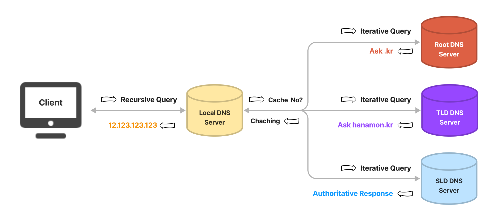
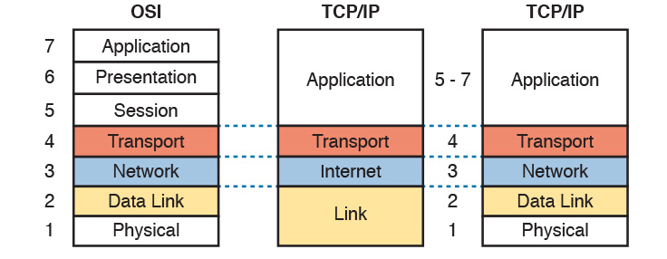

# 네트워크

```
HTTP HTTPS, HTTP Method
쿠키와 세션
DNS
www.naver.com에 접속할 떄 생기는 일
OSI 7계층
TCP와 UDP
TCP 3way / 4way handshake
라우터 / 라우팅 알고리즘
웹소켓
```

## 1. HTTP, HTTP Method, HTTPS

### HTTP

✔ Hyper Text Transfer Protocol: 링크를 통해 텍스트와 파일을 전송하는 프로토콜

✔ HTTP의 특징
- Stateless: 상태를 가지거나 기억하지 않고 들어온 request만 처리한다
  - 쿠키나 세션 이용해 보완!
- TCP: 하위 계층인 transport layer에서 TCP를 사용해서 해당 프로토콜의 기능들을 가져온다

✔ HTTP connections
- non-persistent HTTP: 데이터 전달 시 TCP 연결 생성, 데이터 전달 완료 시 TCP 연결 종료
- persistent HTTP: 데이터 전달 시 TCP 연결 생성, 해당 TCP의 연결을 끊지 않고 계속 사용
  - 대부분의 웹사이트에서 해당 방식 사용

### HTTP Method

✔ GET: 서버에 리소스를 요청

✔ POST: 서버에 데이터를 전송 (리소스의 생성 / 변경)

✔ PUT: 서버의 리소스를 갱신 

✔ DELETE: 서버의 리소스를 삭제

✔ PATCH: 서버의 리소스를 부분적으로 갱신

✔ OPTIONS: 리소스의 통신 옵션(메서드) 질의

✔ HEAD: 리소스의 헤더 정보만 요청

#### GET vs POST

✔ GET
- 데이터 조회
- 데이터 위치: Header(헤더)
- URL에 데이터 노출
- 캐싱을 통한 속도 향상
- 보안 ↓

✔ POST
- 데이터 생성 / 수정
- 데이터 위치: Body(바디)
- URL에 데이터 노출 x
- GET 방식보다 안전

### HTTP 상태 코드

✔ 2xx (Successful): 요청을 성공적으로 받았으며 인식했고 수용하였다
- 200(OK): 요청이 성공적으로 수행됨 (주로 GET 요청에 대한 응답)
- 201(Created): 요청이 성공적으로 수행되어 새로운 리소스가 생성됨 (주로 POST)
- 204(No Content): 요청이 성공적으로 수행되어 리소스가 없음(주로 DELETE)

✔ 3xx (Redirection): 요청 완료를 위해 추가 작업 조치가 필요하다
- 301(Moved Permanently): 요청된 리소스의 URI가 변경됨
- 302(Found): 요청된 리소스의 URI가 일시적으로 변경됨 (ex: pc -> 모바일)

✔ 4xx (Client Error): 요청의 문법이 잘못되었거나 요청을 처리할 수 없다
- 400(Bad Request): 클라이언트가 잘못된 요청(ex: 문법)을 보냄
- 401(Unauthorized): 인증되지 않은 클라이언트 
- 403(Forbidden): 권한이 없는 클라이언트 (서버는 클라이언트가 누구인지 알고 있다)
- 404(Not Found): 요청한 리소스가 존재하지 않음
- 405(Method Not Allowed): 현재 리소스에 맞지 않은 메서드 사용
- 406(No Acceptable): 알맞은 컨텐츠 타입이 없음
- 408(Request Time Out): 요청에 응답하는 시간이 너무 오래걸림

✔ 5xx (Server Error): 서버가 명백히 유효한 요청에 대해 충족을 실패했다
- 500(Internal Server Error): 서버에 오류 발생
- 502(Bad Gateway): 서버의 부모 서버에서 오류 발생 (ex: 트래픽 과부하)
- 503(Service Unavailable): 서버가 요청을 처리할 준비가 되지 않음(ex: 유지보수)

### HTTPS

✔ HTTPS: HTTP + SSL(Secure Socket Layer)

✔ 기존의 HTTP는 별도의 보안 장치 없이 plain text message를 전송하기 때문에 탈취의 위험이 있음!

✔ SSL(Secure Socket Layer) = TLS(Transport Layer Security)
- **plain text message가 SSL library를 거쳐 암호화된 이후 TCP로 내려간다**
- 비대칭키 암호화(초기 연결)과 대칭키 암호화(메세지 전송) 방식 사용

## 2. 쿠키와 세션

✔ 둘 다 웹 어플리케이션에서 사용자의 state를 저장/유지 하기 위해서 사용 (HTTP는 stateless!)

✔ 가장 큰 차이점은 **데이터의 저장 위치!**

### 쿠키(Cookie)

✔ **쿠키: 클라이언트 측에 저장되는 키와 값이 들어있는 작은 데이터 파일**

✔ 유효기간 설정 가능(브라우저 종료 이후에도 유지)

✔ 300개 제한(도메인당 20개, 쿠키 당 4KB)

- 클라이언트가 따로 요청하지 않아도 브라우저가 Request시에 Request Header를 넣어서 자동으로 서버에 전송

### 세션(Session)

✔ **세션: 서버 측에 데이터를 저장하는 방식**

✔ 서버에서는 클라이언트를 구분하기 위해 고유한 세션 ID 부여

✔ 주로 브라우저 종료 시 종료(별도 유효기간도 설정 가능)

✔ 쿠키보다 보안은 좋지만, 사용자가 많아질수록 서버 메모리 과부하↑

✔ 서버로부터 데이터를 받아오기 위한 추가 처리 속도


## 3. DNS (Domain Name Server)



✔ DNS: Domain Name을 IP 주소로 바꿔주는 시스템

✔ DNS 서버는 계층 구조로 이루어져있다

- Recursive(Local) Name Server: 사용자가 가장 먼저 접근하는 서버 (캐시 형태로 ip정보 저장, ex: ISP(통신사))
- Root Name Server: 최상위 dns 서버 (전세계 13개), DNS 쿼리를 적절한 TLD 서버로 내려준다
- TLD(Top-Level Domain) Name Server: .com, .co.kr 등 뒤에 오는 도메인 확장자에 대한 정보 유지
- SLD(Second-Level Domain)/Authoratice Name Server: 실제 도메인의 IP 주소에 대한 정보를 유지하는 서버

## 4. 웹 동작 과정


1. 클라이언트가 브라우저에 URL(www.google.com)을 입력
2. DNS 서버에 도메인 네임으로 서버의 진짜 주소(IP 주소)를 찾음
3. 브라우저는 IP 주소로 된 웹서버와 3 Way Handshake를 통한 TCP 연결 수립
4. 클라이언트가 웹서버에 HTTP 요청 송신
5. 요청을 수신한 웹 서버는 HTTP 응답을 송신
6. 브라우저는 수신한 HTTP 응답을 기반으로 HTML 페이지 렌더링 후 사용자에게 요청한 웹페이지 반환

## 5. OSI 7계층 / TCP/IP 5계층

