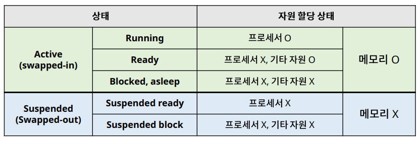
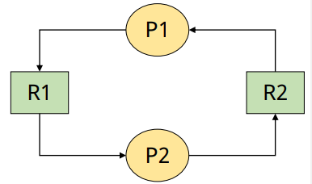

# 운영체제

    1. 프로세스와 스레드의 차이
    2. 데드락
    3. 세마포어 & 뮤텍스
    4. 컨텍스트 스위칭
    5. 선점형 스케줄링 비선점형 스케줄링
    6. paging system segmentation system
    7. paging algorithm
    8. caching
    9. 가상 메모리(단편화) + page fault 
    10. 메모리 구조
    11. 디스크 스케줄링
    12. raid

## 1. 프로세스와 스레드의 차이

### 프로세스 (Process)

✔ **실행을 위해 시스템 커널에 등록된 작업**
- 커널에 등록되고 커널의 관리 하에 있는 작업
- 각종 자원들을 요청하고 할당 받을 수 있는 개체
- 프로세스 관리 블록 (PCB)을 할당 받은 개체
- 능동적인 개체(active entity): 실행 중에 각종 자원을 요구, 할당, 반납하며 진행

✔ **자원을 할당 받고, 목표를 이루기 위해 할당받은 자원을 제어 한다**

✔ PCB (Process Control Block)
- 커널 공간 내에 존재하는 프로세스 관리에 필요한 정보를 저장하기 위한 공간

#### 프로세스의 상태 (state)

### 스레드 (Thread)

✔ **프로세스의 실행 단위**
- 프로세스의 **제어 부분만 분리**해 프로세스가 할당 받은 자원을 제어한다

✔ 각 스레드마다 **자신의 작업 영역(Stack)**을 할당 받는다

✔ **자원(Resource) 공유**
 - 효율성 / 경제성 증가 (context switching x)

### 프로세스 vs 스레드

✔ 프로세스는 시스템 커널에 등록 돼 자원을 할당 받은 작업이며, 스레드는 프로세스의 실행단위로 할당 받은 자원은 제어한다.

✔ **각각 자원을 할당 받는 프로세스**와 달리 **스레드는 프로세스의 자원은 공유**하고, 자신만의 작업 영억인 stack을 할당 받아서 지역데이터를 저장한다

✔ 또한 프로세스는 교체 시 context switching이 발생해 overhead가 발생하는 반면, 스레드는 멀티스레딩 등을 통해 해당 overhead를 최소화 할 수 있다.(스레드 자체도 커널 스레드의 경우 context switching 존재) 

## 2. Deadlock (데드락)

### Deadlock의 개념

✔ **프로세스가 발생 가능성이 없는 이벤트를 기다리는 경우**

✔ P1은 P2가 가지고 있는 R1을, P2는 P1이 가지고 있는 R2를 요청하고 있다 -> 서로 발생 가능성이 없는 이벤트를 기다리고 있으므로 deadlock!

#### starvation vs deadlock

✔ starvation -> ready state

✔ deadlock -> asleep state

✔ **starvation은 '운이 없어서' 프로세서를 할당받지 못한 상태일 뿐 발생 가능성이 없는 것은 아니다!!**

